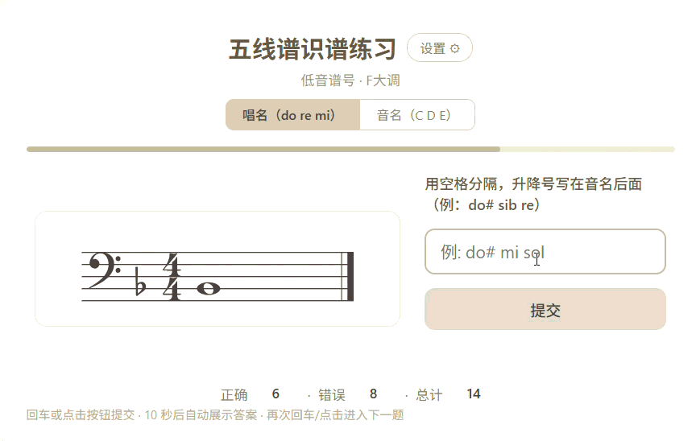
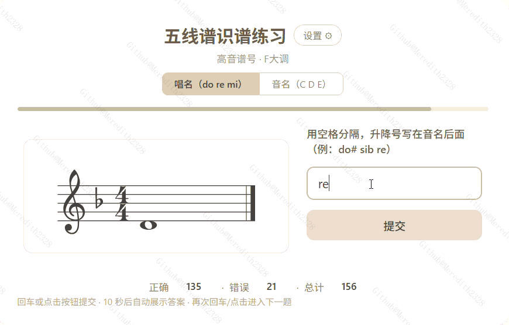

# notegotya·五线谱识谱练习玩具

一个简单的五线谱识谱练习玩具，支持高音/低音谱号、调号、临时变音记号与和弦。



## 功能

- **随机出题** — 单音、双音、三音和弦，高音谱号 / 低音谱号
- **调号支持** — C、G、D、A、E、F、Bb、Eb 大调，自动渲染调号
- **临时变音** — 升降号与还原号随机出现
- **双模式回答** — 唱名（do re mi）或音名（C D E），变音后缀写法（do# / sib）
- **限时训练** — 可调倒计时（含进度条），设为 0 秒即不限时
- **自定义选题** — 可指定调号、谱号、音名范围、音数、是否无尽模式

> 当前没有保存游玩进度的功能，浏览器刷新后游玩进度即清空。可以按需自行截图。

## 有趣的玩法

**可以设置同一个谱号、某些简单的调号、自然音，享受沉浸爽感体验。**



## 本地运行

```bash
python -m http.server 8080
# 浏览器打开 http://localhost:8080
```

或直接双击 `index.html`。

## 相关技术

- 纯前端，无构建工具
- 五线谱渲染：[abcjs](https://www.abcjs.net/)
